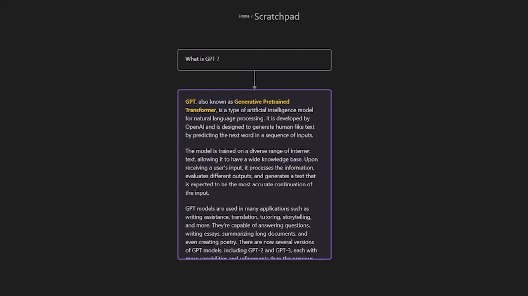
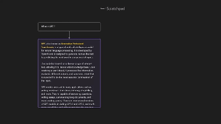
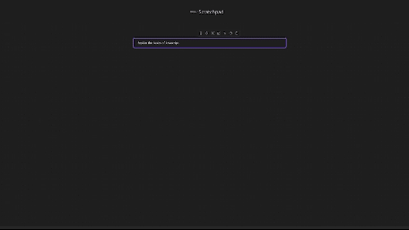

# Obsidian AI Canvas

A plugin for [Obsidian](https://obsidian.md) that brings AI-powered features to Obsidian Canvas with intelligent note interactions and content generation.

**Based on:** This plugin is a fork of [MetaCorp/obsidian-augmented-canvas](https://github.com/MetaCorp/obsidian-augmented-canvas) - thank you to MetaCorp for the original foundation and concept.

You need an API key from one or more supported LLM providers to use this plugin. The plugin supports multiple providers including OpenAI, Anthropic, Groq, and others. You can configure your providers and models in the settings.

## Key Features

This plugin adds three actions to the Menu of a note in the Canvas View.

1. Ask AI on a specific note, the note content will be used as prompt. The note can be a text note, a md file or a PDF file. A new note will be created underneath the prompt note containing the AI response.

2. Ask question about a note. Also makes the AI generate a new note, the question is placed on the link between the two notes.

The links between notes are used to create the chat history sent to the AI.

## Additional Features

- The plugin adds an action to create an image in the context menu of a note in the canvas.

- The plugin adds a command named "Run a system prompt on a folder". Reading all md and canvas files present in that folder and sub-folders and inserting the response in the current canvas.

- The plugin adds a command named "Insert system prompt". This command will insert a chosen system prompt to the current canvas. The system prompts are fetch from [f/awesome-ai-prompts (github.com)](https://github.com/f/awesome-ai-prompts). You can also add your own system prompts in the settings.

- The plugin can create flashcards for you which can be revised using the [Spaced Repetition plugin](https://github.com/st3v3nmw/obsidian-spaced-repetition). Right click on a note to create flashcards. Then wait for the AI response and a new file will be created inside the folder specified in the settings. You can then revise this specific deck. Think about activating "Convert folders to decks and subdecks?" option in the settings of the Spaced Repetition plugin.

- The plugin adds a command named "Insert relevant questions". This command inserts AI generated questions to the current canvas. The plugin reads and then sends your historical activity to the AI, reading the last X files modified (configurable in the settings).

- The plugin adds an action to the edge context menu to regenerate an AI response.

## Multiple LLM Providers

The plugin supports multiple LLM providers that are compatible with the OpenAI API format. This allows you to:

- Use commercial providers like OpenAI, Anthropic, Groq, etc.
- Connect to self-hosted models via providers like Ollama
- Mix and match different models for different tasks

To configure providers and models:

1. Go to plugin settings
2. In the Providers section:
   - Configure API keys for built-in providers
   - Add custom providers if needed
   - Enable/disable providers as needed
3. In the Models section:
   - Enable/disable specific models
   - Configure model settings if needed

Each provider should point to an API endpoint that's compatible with the OpenAI API format.

## Privacy

The content that is send to the AI can be viewed by toggling on the "Debug output" setting. The messages then appear in the console.

## Installation

- Not ready for market yet
- Can be installed via the [Brat](https://github.com/TfTHacker/obsidian42-brat) plugin
    You can see how to do so in this Ric Raftis article: <https://ricraftis.au/obsidian/installing-the-brat-plugin-in-obsidian-a-step-by-step-guide/>
- Manual installation

1. Find the release page on this github page and click
2. Download the latest release zip file
3. Unzip it, copy the unzipped folder to the obsidian plugin folder, make sure there are main.js and manifest.json files
   in the folder
4. Restart obsidian (do not restart also, you have to refresh plugin list), in the settings interface to enable the
   plugin
5. Done!

## Credits

**Original Plugin:** [MetaCorp/obsidian-augmented-canvas](https://github.com/MetaCorp/obsidian-augmented-canvas) - Original concept and implementation by MetaCorp

**Additional Inspiration:**

- [rpggio/obsidian-chat-stream: Obsidian canvas plugin for using AI completion with threads of canvas nodes (github.com)](https://github.com/rpggio/obsidian-chat-stream)
- [Quorafind/Obsidian-Collapse-Node: A node collapsing plugin for Canvas in Obsidian. (github.com)](https://github.com/quorafind/obsidian-collapse-node)

## License

MIT License - see LICENSE file for details.

This work is based on the original Augmented Canvas plugin by MetaCorp, used under MIT license.
