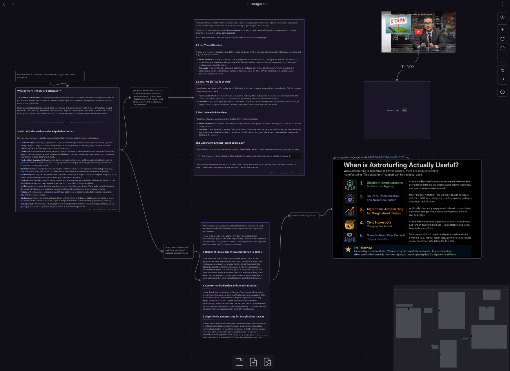

# Obsidian AI Canvas

<p align="center">
  <strong>Transform your Obsidian Canvas into a spatial AI thinking workspace.</strong><br>
  Chat with notes, reason across images, ingest YouTube videos and web pages, generate art, and map complex ideas with visual threads — zero coding required.
</p>

<p align="center">
  <a href="https://github.com/testy-cool/obsidian-ai-canvas/releases"></a>
  <a href="https://obsidian.md"></a>
  <a href="LICENSE"></a>
  <a href="https://github.com/testy-cool/obsidian-ai-canvas/stargazers"></a>
</p>

---



---

## Why Obsidian AI Canvas?

Traditional AI chat sidebars trap your thinking in a narrow, linear scroll. Questions disappear, context gets lost, and exploring two different ideas at once is frustrating.

**Obsidian AI Canvas frees your AI interactions onto an infinite 2D canvas:**

* 🗺️ **Think Spatially**: Place your notes, references, web pages, images, and AI responses anywhere on the board.
* 🌿 **Visual Branching Threads**: Connect cards with arrows to create conversation branches. Explore "what if" scenarios side-by-side without erasing your original thoughts.
* 🧘 **Calm & Non-Destructive**: Your personal notes are never overwritten. Every AI reply appears in a newly linked card right next to its source.
* 🤝 **Built for Everyone**: No developer knowledge or prompt engineering jargon needed. If you know how to drag a card and right-click, you can use every single feature.

---

## Core Superpowers

### 🎨 Generate Images on Canvas
Turn prompts and ideas into striking illustrations and diagrams directly on your canvas.
* Right-click any note or prompt card → **Generate image**.
* AI generates the visual (via Google Imagen 3, OpenAI DALL-E, Azure, or Vertex AI) and attaches the file directly into your vault attachments.
* Connect notes to the image to critique, remix, or brainstorm from the visual output.

### 👁️ Multimodal Vision (Text & Insights from Images)
Drop screenshots, handwriting, infographics, diagrams, or photos onto your canvas.
* Connect an image to a question card and click **Ask AI**.
* Transcribe handwritten brainstorms, explain complex architecture diagrams, extract tables from screenshots, or critique UI designs with top-tier vision models (Gemini, GPT-4o, Claude 3.7).

### 🎥 YouTube Video Intelligence
Turn hours of video lectures, podcasts, or tutorials into searchable canvas knowledge.
* Place a YouTube card on the canvas or reference a video link.
* Ask questions, request executive summaries, or extract key timestamps.
* Supports native Google Gemini video context as well as command palette transcript fetching (`Obsidian AI Canvas: Fetch YouTube Video Captions`).

### 🌐 Ingest Live Websites & Web Pages
Bring articles, documentation, or news stories straight onto your canvas.
* Pull clean markdown text from any web page using built-in webpage extraction (`Obsidian AI Canvas: Fetch Website Content`) or native URL context.
* Compare two competing articles side-by-side on the canvas and ask the AI to synthesize the commonalities and differences.

### ⚡ Real-Time Streaming with Instant Stop
* Watch AI thoughts stream seamlessly into your cards as they generate.
* Need to tweak your direction? Hit the **Stop** button on the card menu at any time to instantly halt generation without losing what has already been typed.

### 🎛️ Per-Card Model Freedom
* Pick different models for different tasks on the same canvas! Use a fast, free model for quick summaries, a frontier reasoning model for deep analysis, and an image model for concept art.
* Click the **Model Picker** icon on any card to select the provider and model for just that generation.

### 🛠️ Model Context Protocol (MCP) Tools
* Connect live external tools to your canvas notes via Model Context Protocol (MCP).
* Give your canvas access to live web searches, custom APIs, local databases, or automation scripts.

### 🗂️ Instant Flashcards for Study
* Highlight or right-click any note to generate flashcards formatted for the [Spaced Repetition](https://github.com/st3v3nmw/obsidian-spaced-repetition) plugin. Turn lecture notes into active recall decks in seconds.

---

## 60-Second Quickstart (Effortless Setup)

Getting started takes less than a minute — even if you've never used an AI API before.

### Step 1: Install the Plugin
* **Option A (BRAT):** In Obsidian Settings → Community Plugins → install [Obsidian42 - BRAT](https://github.com/TfTHacker/obsidian42-brat) → Add Beta plugin: `testy-cool/obsidian-ai-canvas`.
* **Option B (Manual):** Download `main.js`, `manifest.json`, and `styles.css` from the [Latest Release](https://github.com/testy-cool/obsidian-ai-canvas/releases) and place them into your vault folder: `<vault>/.obsidian/plugins/obsidian-ai-canvas/`.
* Enable **Obsidian AI Canvas** in your Community Plugins settings.

### Step 2: Add an API Key (Google Gemini Recommended)
1. Go to **Obsidian Settings → AI Canvas → Providers**.
2. We recommend **Google Gemini** to start:
   * It provides a generous free tier (no credit card required).
   * It supports text, vision, PDF documents, and YouTube context out of the box.
   * Grab your free key at [Google AI Studio](https://aistudio.google.com/).
3. Paste your key, click **Save**, and enable your preferred models (e.g., `gemini-2.5-flash` or `gemini-2.5-pro`).
   *(Prefer 100% offline and private? Connect [Ollama](https://ollama.com/) with zero keys needed!)*

### Step 3: Start Creating on Canvas!
1. Open any `.canvas` file in Obsidian.
2. Double-click to create a note card with your question (e.g., *"Summarize the core themes of Stoicism in 3 bullet points"*).
3. Right-click the note and select **Ask AI** (or click the ✨ **Sparkles** icon on the card toolbar).
4. Watch the AI create a new connected card with your response!

---

## Everyday Visual Workflows

### 1. The Research & Study Board
```text
[ Web Article Card ] ────┐
                          ▼
[ YouTube Video Card ] ───► [ Prompt: Compare these two perspectives ]
                          ▲
[ PDF Paper Card ] ───────┘
                          │
                          ▼ (Ask AI)
            [ Synthesis & Analysis Card ]
                          │
                          ▼ (Create Flashcards)
               [ Spaced Repetition Cards ]
```

### 2. The Creative Director (Text + Image Loop)
```text
[ Character Concept Note ] ──► (Generate Image) ──► [ AI Concept Art Card ]
                                                             │
                                                             ▼ (Connect note)
                                                  [ "Suggest 3 costume variations" ]
                                                             │
                                                             ▼ (Ask AI)
                                                  [ Detailed Wardrobe Ideas ]
```

### 3. The Visual Bug & Diagram Solver
```text
[ Screenshot of UI or Architecture ] ──► [ Prompt: "What design or UX issues do you spot?" ]
                                                              │
                                                              ▼ (Ask AI)
                                                  [ Actionable Fixes & Checklist ]
```

---

## Canvas Toolbar & Controls

When you click on any card on the Canvas, Obsidian AI Canvas adds convenient quick-action icons:

| Icon | Action | Description |
| :---: | :--- | :--- |
| ✨ | **Ask AI** | Generates a response from the card's text using your default provider and model. |
| 🤖 | **Ask AI with Model** | Opens a fast picker to choose a specific provider or model for this single query. |
| 🔄 | **Regenerate** | Re-runs the generation with current connected context. |
| ⏹️ | **Stop** | Instantly halts active streaming generation. |
| 📋 | **Card Context Menu** | Right-click for *Generate Image*, *Create Flashcards*, or *Ask Custom Question*. |

---

## Comparison: Sidebar Chat vs. Obsidian AI Canvas

| Capability | Standard Sidebar Chat | Obsidian AI Canvas |
| :--- | :---: | :---: |
| **Workspace Layout** | Cramped vertical column | Infinite 2D visual board |
| **Non-Linear Branching** | ❌ Impossible (one thread) | ✅ Infinite branching via connected cards |
| **Image Generation** | ⚠️ Isolated in chat | ✅ Direct image cards saved into vault |
| **Multimodal Vision** | ⚠️ One-off upload | ✅ Link diagrams and photos to notes |
| **YouTube & Web Context** | ❌ Manual copy-paste | ✅ Direct link ingest & transcript tools |
| **Model Freedom** | Fixed to one provider | ✅ Mix & match Gemini, Claude, OpenAI, Ollama |
| **Local / Offline AI** | Rare | ✅ 100% private local models via Ollama |
| **Vault Integration** | Fleeting chat bubbles | ✅ Persistent markdown notes in your vault |

---

## Supported AI Providers

Obsidian AI Canvas connects with virtually all leading AI platforms:

* **Google Gemini:** `gemini-2.5-flash`, `gemini-2.5-pro`, `gemini-1.5-flash`, `imagen-3` *(Generous free tier, multimodal vision, YouTube and URL context)*
* **OpenAI:** `gpt-4o`, `gpt-4o-mini`, `o1`, `o3-mini`, `dall-e-3`
* **Anthropic:** `claude-3-7-sonnet`, `claude-3-5-sonnet`, `claude-3-5-haiku`
* **Ollama (Local & 100% Private):** `llama3.3`, `deepseek-r1`, `mistral`, `qwen2.5`, etc.
* **Groq:** Ultra-fast open models (`llama-3.3-70b-versatile`)
* **OpenRouter / Vertex AI / Azure OpenAI**
* **Custom Gateways:** Any OpenAI-compatible proxy (e.g. Bifrost, LiteLLM)

---

## Privacy & Local First

* **Your Vault is Yours:** Notes created by AI Canvas are standard Markdown files stored locally in your vault.
* **No Telemetry or Third-Party Intermediaries:** Requests travel directly from your Obsidian app to your chosen AI provider using your own API key.
* **100% Offline Capability:** When paired with [Ollama](https://ollama.com/), your entire AI workflow runs locally on your machine with zero internet access required.

---

## Development & Contributing

Contributions, feature ideas, and issue reports are warmly welcomed!

* **Development Workflow:** See [docs/development-workflow.md](docs/development-workflow.md) for build, testing, and contribution instructions.
* **Testing:** The repo includes a full Vitest test suite (`pnpm test`).
* **Building:** Run `pnpm run dev` to watch or `pnpm run build` for production bundles.

---

## Credits & License

* Originally based on [MetaCorp/obsidian-augmented-canvas](https://github.com/MetaCorp/obsidian-augmented-canvas).
* Distributed under the **MIT License**. See [LICENSE](LICENSE) for details.
